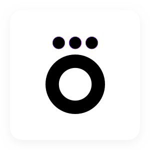

<h1 align="center">
  
  <br>Okko for iOS<br>
  <p align="center">
    
    <a href="LICENSE.md"></a>
    
  </p>
</h1>
<p align="center">Application for manages the transition animation</p>
<br></br>
<p align="center"></p>

## Task description

It is required to develop an application presenting a modal screen. Height of this screen can be equal at half or three quarts of the parent screen height, it can transition between these states via animation. Also, the modal screen at the half-height state can be dismissed by user swipe.


## Restrictions

To complete the task, must adhere to certain restrictions for the technological stack and the content of the project:

* [x] Use swift programming language.
* [x] It's necessary to use the custom UIPresentationControlller.
* [x] It's necessary to use the UIPanGestureRecognizer.


## Requirements

In order to compile Okko entrance test you will need to meet the following requirements:
```
- A Mac with Xcode 10 or later
- Git command line tools or a git source control client like GitKraken
```

## License

Okko entrance test is available under the MIT license. See the [LICENSE.md](LICENSE.md) file for more info.
